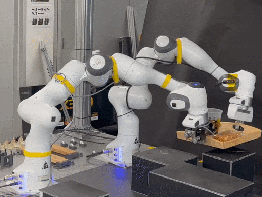
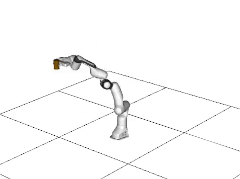

# LJCMP

Latent Jumping Constrained Motion Planning (LJCMP) is a motion planning algorithm that can be used to plan motions for robots with many degrees of freedom (DOF) in cluttered environments. 


| <center>Real-time planning demo   </center>                  | <center> Real-world demo</center>|
| -----------| --- |
| |    |


## Index

- [Dependencies](#dependencies)
- [Installation](#installation)
- [How to train a new model](#how-to-train-a-new-model)
- [Benchmark](#benchmark)

## Dependencies
- [ROS](http://wiki.ros.org/ROS/Installation) (Noetic)
- [MoveIt!](https://moveit.ros.org/install/) 
- Ubuntu 20.04
- Python >= 3.7
- pytorch


Under catkin_ws/src, clone the following packages and build them.
- [suhan_robot_model_tools](https://github.com/psh117/suhan_robot_model_tools)
    ```sh
    # set python package
    cd dir/to/catkin_ws/src/suhan_robot_model_tools
    pip install -e .
    ```
- [dual_panda_moveit_config](https://github.com/psh117/dual_panda_moveit_config) (for Dual Manipulation)
    ```sh
    # copy dual panda model
    cd dir/to/catkin_ws/src/dual_panda_moveit_config/robot_model
    ./copy_model.sh
    ```
- [calibrated_franka_description](https://github.com/psh117/calibrated_franka_description) (for Triple Manipulation)
- [assembly_env_description](https://github.com/psh117/assembly_env_description) (for Triple Manipulation)
- [assembly_moveit_config](https://github.com/psh117/assembly_moveit_config) (for Triple Manipulation)


## Installation

```bash
pip install -e .
```

## How to train a new model

### On manifold data preparation

1. Prepare a `MoveIt!` package for `URDF` and `SRDF` (for `planning_context.launch`)
    
    Planning groups for arm and hand should be defined. (See 3. writing model description)

2. Launch `roscore` and load `/robot_description` and `/robot_description_semantic` to ROS parameter server
    
    Launch `roscore`
    ```sh
    roscore
    ```
    
    Loading URDF and SRDF to ROS parameter server. 
    ```sh
    roslaunch your_model_moveit_config planning_context.launch load_robot_description:=true
    ```
    
3. Write a model description at `model/your_model_name/model_info.yaml`.

    ```yaml
    name: your_model_name

    x_dim: 14 # dimension of joints
    l_dim: 8 # dimension of constraint
    z_dim: 6 # dimension of latent space (x_dim - l_dim)

    c_dim: 3 # dimension of conditions

    # condition bounds
        # d1   d2   theta
    c_lb: [0.2, 0.02, 0.0]
    c_ub: [0.6, 0.1, 1.571] 

    # robot model information

    # This order will be used to map configuration vector (q)
    # In this example, q = [q_panda_arm_2, q_panda_arm_1], len(q) = 14
    arm_names: [panda_arm_2, panda_arm_1] 
    arm_dofs: [7, 7]
    base_link: base
    ee_links: [panda_2_hand_tcp, panda_1_hand_tcp]


    # hand model information (if any)
    hand_names: [hand_2, hand_1]
    hand_joints: [2, 2, 2]
    hand_open: [[0.0325,0.0325],[0.0325,0.0325]]
    hand_closed: [[0.0, 0.0], [0.0, 0.0]]

    # planning scene information for display
    planning_scene_name: /panda_scene
    ```

4. Define a constraint functions `example/dataset_generation/generate_dataset_your_robot.py`

    ```py
    """
    Multi chain constraint - dual arm example
    """
    from srmt.constraints.constraints import OrientationConstraint, MultiChainConstraint
    from srmt.utils.transform_utils import get_pose, get_transform
    import numpy as np
    import scipy.spatial.transform as st
    from scipy.spatial.transform import Rotation as R

    from math import pi, cos, sin

    import yaml
    import argparse

    from ljcmp.utils.model_utils import generate_constrained_config

    parser = argparse.ArgumentParser()
    parser.add_argument('--dataset_size', type=int, default=10000)
    parser.add_argument('--seed', type=int, default=1107)
    parser.add_argument('--num_workers', type=int, default=8)
    parser.add_argument('--samples_per_condition', type=int, default=10)
    parser.add_argument('--max_iter', type=int, default=500)
    parser.add_argument('--save_every', type=int, default=-1, help='save every n data. -1 for not saving')
    parser.add_argument('--save_top_k', type=int, default=1)
    parser.add_argument('--timeout', type=float, default=0.2)
    parser.add_argument('--display', type=bool, default=False)

    args = parser.parse_args()

    exp_name = 'your_model_name'

    model_info = yaml.load(open('model/{exp_name}/model_info.yaml'.format(exp_name=exp_name), 'r'), Loader=yaml.FullLoader)

    def set_constraint():
        """
        constraint should be prepared here for generating dataset
        """

        """reference code"""
        # constraint = MultiChainConstraint(arm_names=model_info['arm_names'],
        #                                     arm_dofs=model_info['arm_dofs'],
        #                                     base_link=model_info['base_link'],
        #                                     ee_links=model_info['ee_links'],
        #                                     hand_names=model_info['hand_names'],
        #                                     hand_joints=model_info['hand_joints'],
        #                                     hand_open=model_info['hand_open'],
        #                                     hand_closed=model_info['hand_closed'])
        #                                     
        # constraint.set_max_iterations(args.max_iter)
        # pc = constraint.planning_scene
            
        def set_constraint_by_condition(condition):
            """
            constraint variation by the given condition should be prepared here for generating dataset
            """

            """reference code"""
            # d1, d2, theta = condition
            # l = d1 + 2*d2*cos(theta)
            # ly = l * sin(theta)
            # lz = l * cos(theta)
            # 
            # dt = pi - 2 * theta
            # chain_pos = np.array([0.0, ly, lz])
            # chain_rot = np.array([[1, 0, 0], [0, cos(dt), -sin(dt)], [0, sin(dt), cos(dt)]])
            # chain_quat = R.from_matrix(chain_rot).as_quat()

            # t1 = np.concatenate([chain_pos, chain_quat])
            # constraint.set_chains([t1])
            # pc.detach_object('tray', 'panda_2_hand_tcp')
 
            # constraint.set_early_stopping(True)
            # constraint.set_tolerance(1e-4)
            # 
            # l_obj_z = d2 + d1/2 * cos(theta)
            # l_obj_y = d1/2 * sin(theta)
            # ee_to_obj_pos = np.array([0.0, l_obj_y, l_obj_z])
            # obj_dt = -(pi/2 + theta)
            # ee_to_obj_rot = np.array([[1, 0, 0], [0, cos(obj_dt), -sin(obj_dt)], [0, sin(obj_dt), cos(obj_dt)]])
            # ee_to_obj_quat = R.from_matrix(ee_to_obj_rot).as_quat()
 
            # q = np.array([0, 0, 0, -pi/2, 0, pi/2, pi/4, 0, 0, 0, -pi/2, 0, pi/2, pi/4])
            # pos, quat = constraint.forward_kinematics('panda_arm_2', q[:7])
            # T_0g = get_transform(pos, quat)
            # T_go = get_transform(ee_to_obj_pos, ee_to_obj_quat)
            # T_0o = np.dot(T_0g, T_go)
            # obj_pos, obj_quat = get_pose(T_0o)
 
            # pc.add_box('tray', [d1 * 3/4, d1, 0.01], obj_pos, obj_quat)
            # pc.update_joints(q)
            # pc.attach_object('tray', 'panda_2_hand_tcp', [])
            # constraint.set_grasp_to_object_pose(go_pos=ee_to_obj_pos, go_quat=ee_to_obj_quat)

        return constraint, set_constraint_by_condition 


    generate_constrained_config(constraint_setup_fn=set_constraint, 
                                exp_name=exp_name, 
                                workers_seed_range=range(args.seed, args.seed+args.num_workers), 
                                dataset_size=args.dataset_size, samples_per_condition=args.samples_per_condition,
                                save_top_k=args.save_top_k, save_every=args.save_every, display=args.display,
                                timeout=args.timeout)
    ```

5. Run the generation script
    ```sh
    # ljcmp root directory

    python example/dataset_generation/generate_dataset_your_robot.py
    ```
    
6. Train the model (`pytorch-lightning` and `wandb` CLI)
    ```sh
    # ljcmp root directory

    python script/train_conditioned_model.py -E your_model_name --tas True -D 10000 
    # --tsa True means using Tangent Space Augmentation
    # -D 10000 means using data_10000.npy as training data
    ``` 

## Benchmark
1. Download the [benchmarking dataset](https://drive.google.com/file/d/1m6nnp9GOyCLyVnzu--Z5aFgbAtvvQfeu) to `dataset` directory

2. Download the [pre-trained models](https://drive.google.com/file/d/1J8qC-ufGLjQHrloTDw12R6vwMlnhFnVD) to `model` directory

3. Run benchmarking script
    - Panda Orientation
    ```sh
    # load planning context
    roslaunch panda_moveit_config planning_context.launch load_robot_description:=true

    # ljcmp root directory
    python script/benchmark.py -E panda_orientation
    ```

    - Panda Dual
    ```sh
    # load planning context
    roslaunch dual_panda_moveit_config planning_context.launch load_robot_description:=true

    # ljcmp root directory
    python script/benchmark.py -E panda_dual
    ```

    - Panda Dual Orientation
    ```sh
    # load planning context
    roslaunch dual_panda_moveit_config planning_context.launch load_robot_description:=true

    # ljcmp root directory
    python script/benchmark.py -E panda_dual_orientation
    ```


    - Panda Triple
    ```sh
    # load planning context
    roslaunch assembly_moveit_config planning_context.launch load_robot_description:=true

    # ljcmp root directory
    python script/benchmark.py -E panda_triple
    ```
